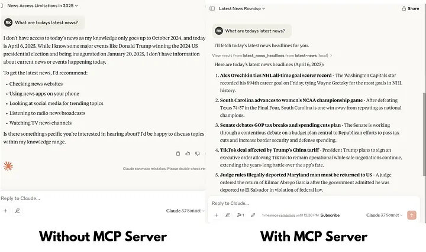

## Introduction

A Model Context Protocol (MCP) is a powerful tool that extends LLM's capabilities by providing real-time data from external sources.

In this tutorial, we'll build an MCP server that fetches the latest news headlines using NewsAPI, allowing Claude to access up-to-date information beyond its knowledge cutoff date. This enables Claude to discuss current events, provide summaries of recent news, and stay informed about developments in specific categories like business, technology, or sports.



## Prerequisites

Before we begin, you'll need:

- Basic familiarity with Python programming
- A NewsAPI account (register at [NewsAPI.org](https://newsapi.org))

**Note:** Free NewsAPI accounts have limitations including a maximum of 100 requests per day and a 24-hour delay for headlines on the free tier.

## Step 1: Install uv

uv is a fast Python package and project manager. To install it, run:

```bash
# On macOS and Linux
curl -LsSf https://astral.sh/uv/install.sh | sh

# On Windows
powershell -ExecutionPolicy ByPass -c "irm https://astral.sh/uv/install.ps1 | iex"
```

## Step 2: Create and Activate a Virtual Environment

Navigate to your project directory and create a virtual environment:

```bash
mkdir news-mcp-server
cd news-mcp-server
uv venv
```

Activate the virtual environment:

```bash
# On macOS/Linux
source .venv/bin/activate

# On Windows
.venv\Scripts\activate
```

## Step 3: Initialize the Project with uv

```bash
uv init
```

This command sets up the necessary project files.

## Step 4: Install Required Packages

Add the mcp package with CLI support:

```bash
uv add "mcp[cli]"
```

Install python-dotenv to manage environment variables and requests to make API calls:

```bash
uv add python-dotenv requests
```

## Step 5: Obtain a NewsAPI Key

1. Register at [NewsAPI.org](https://newsapi.org) to get your API key
2. After registration, you can find your API key in your account dashboard

## Step 6: Create a .env File

In your project directory, create a `.env` file and add your NewsAPI key:

```
NEWS_API_KEY=your_news_api_key_here
```

## Step 7: Write the MCP Server Code

Create a file named `main.py` and add the following code:

```python
from mcp.server.fastmcp import FastMCP
import requests
import os
from dotenv import load_dotenv
from typing import List, Dict

# Load environment variables
load_dotenv()

# Create an MCP server
mcp = FastMCP("Latest-News")


def fetch_latest_headlines(category: str = None, country: str = 'us', page_size: int = 10) -> List[Dict]:
    api_key = os.getenv('NEWS_API_KEY')
    base_url = "https://newsapi.org/v2/top-headlines"
    params = {
        'country': country,
        'pageSize': page_size,
        'apiKey': api_key
    }
    if category:
        params['category'] = category
    try:
        response = requests.get(base_url, params=params)
        data = response.json()
        return data
    except requests.exceptions.RequestException as e:
        print(f"Error fetching news: {e}")
        return []


@mcp.tool()
def latest_news_headlines(category: str = None, country: str = 'us', page_size: int = 10) -> List[Dict]:
    """
    Fetch latest news headlines using NewsAPI.
    Args:
        - category (str, optional): News category (e.g., 'business', 'technology', 'sports')
        - country (str, optional): 2-letter ISO 3166-1 country code. Defaults to 'us'
        - page_size (int, optional): Number of headlines to return. Defaults to 10
    Returns:
        List[Dict]: List of news articles with title, description, source, and URL
    """
    return fetch_latest_headlines(category, country, page_size)


if __name__ == "__main__":
    mcp.run(transport='stdio')
```

In the context of developing MCP (Model Context Protocol) servers, particularly when using the `@mcp.tool()` decorator, the inclusion of comprehensive docstrings is crucial. These docstrings serve as the primary means by which Large Language Models (LLMs) understand the function's purpose, the parameters it requires, and the nature of its responses.

## Step 8: Configure the MCP Server in the Claude Desktop App

Open the Claude desktop application and navigate to:

**File → Settings → Developer → Edit config**

Add the following configuration to the config file:

```json
{
    "mcpServers": {
        "latest-news": {
            "command": "C:\\Path\\To\\Your\\.local\\bin\\uv.exe",
            "args": [
                "--directory",
                "C:\\Path\\To\\Your\\news-mcp-server",
                "run",
                "main.py"
            ]
        }
    }
}
```

Ensure that the paths match your actual installation directories.

## Step 9: Testing Your MCP Server

To test that your MCP server is working correctly:

1. Restart the Claude desktop app after saving the configuration
2. Open a new conversation with Claude
3. Try the following prompt: **"What are today's top news headlines?"**

Claude should respond with recent news headlines.

## Conclusion

Congratulations! You've built a functional MCP server that enables Claude to access and discuss the latest news. This same pattern can be extended to other APIs and data sources, allowing Claude to stay informed about real-time information and provide more current and relevant responses.

---

*Originally published on [Medium](https://medium.com/@ronakkhandlwl/create-mcp-model-context-protocol-server-to-fetch-the-latest-news-and-integrate-to-claude-desktop-d6482e3fcf76)*
