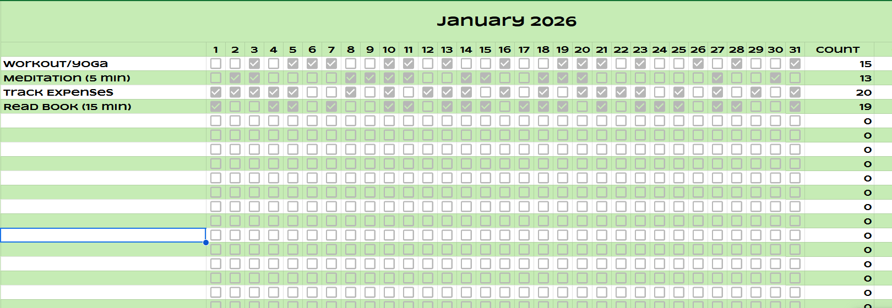

## Introduction

In this tutorial, I'll walk you through how I built a fully automated, interactive Habit Tracker using n8n, Telegram Bots, and Google Sheets. It sends me a checklist every evening, I tap the buttons to check off habits, and it syncs everything to a spreadsheet automatically.




## The Architecture

We are building two separate workflows in n8n:

1. **The Scheduler** - Triggers daily to send the checklist
2. **The Listener** - Handles button clicks (checking off items) and the final "Submit" action

## Prerequisites

Before we begin, you'll need:

- An instance of n8n (running locally or in the cloud)
- Open the [template](https://docs.google.com/spreadsheets/d/16xXZwqnZQv0z1ADVNmf_NL0uHqO0d1DR4tEwImVmtGU/template/preview) in Google Sheets.
- A Telegram account

## Step 1: Creating the Telegram Bot

First, we need a bot identity. Telegram makes this incredibly easy with BotFather.

### Create Your Bot

1. Open Telegram and search for `@BotFather`
2. Send the command `/newbot`
3. Follow the prompts to name your bot (e.g., `MyHabitTrackerBot`)

**Important:** BotFather will give you an API Token. Save this - it's your password.

### Get Your Chat ID

Next, get your own Chat ID so the bot knows who to message:

1. Search for `@userinfobot` in Telegram and click Start
2. It will reply with your ID (e.g., `737228159`). Note this down

## Step 2: Setting Up the Scheduler Workflow

This workflow is simple: at a set time, generate the buttons and send them to the chat.

### 1. The Schedule Trigger

Add a Schedule Trigger node. Set it to run every day at your preferred time (e.g., 9:00 PM).

### 2. Defining the Habits (Python Node)

We need a standardized list of habits mapped to the specific rows in our Google Sheet. Add a Code Node (Python) and use this structure:

```python
# Map habit names to their Row index in Google Sheets
habits = [
    {"text": "Workout/Yoga", "row": 4},
    {"text": "Meditation (5 min)", "row": 5},
    {"text": "Track Expenses", "row": 6},
    {"text": "Read Book (15 min)", "row": 7}
]

# Create the Inline Keyboard structure for Telegram
keyboard = []
for habit in habits:
    # callback_data stores the row number (e.g., "toggle_4")
    keyboard.append([{
        "text": "☐ " + habit["text"], 
        "callback_data": f"toggle_{habit['row']}"
    }])

# Add a Submit button at the end
keyboard.append([{"text": "Done / Save", "callback_data": "submit"}])

return {
    "reply_markup": {
        "inline_keyboard": keyboard
    }
}
```

### 3. Sending the Message (HTTP Request)

Add an HTTP Request node to call the Telegram API.

**Configuration:**
- Method: POST
- URL: `https://api.telegram.org/bot<YOUR_TOKEN>/sendMessage`
- Body: JSON

```javascript
{
  "chat_id": 737228159, // Replace with your Chat ID
  "text": "Daily Habit Tracker - " + $now.toFormat('dd MMM yyyy'),
  "reply_markup": $json.reply_markup
}
```

## Step 3: The Interaction Workflow (The Brains)

This is where the magic happens. When you click a button, Telegram sends a "Callback Query" to n8n.

### 1. Telegram Trigger

Add a Telegram Trigger node:
- **Updates:** Select `callback_query`
- **Authentication:** Use the credentials (Token) you got from BotFather

### 2. The Router (Switch Node)

We need to handle two types of clicks: toggling a checkbox and clicking "Submit". Add a Switch Node with two rules based on `callback_query.data`:

- **Toggle:** If text contains `toggle_`
- **Submit:** If text contains `submit`

## Branch A: Toggling the Checkbox

If I click "Workout", I want the button to change from ☐ Workout to ☑ Workout.

### 1. Update Button State (Python Node)

We parse the incoming keyboard, find the button that was clicked, and flip its icon.

```python
# Get the button ID that was clicked
incoming_callback = _input.all()[0].json['callback_query']['data']
current_keyboard = _input.all()[0].json['callback_query']['message']['reply_markup']['inline_keyboard']

# Find and toggle the specific button
for row in current_keyboard:
    for button in row:
        if button['callback_data'] == incoming_callback:
            if "☐" in button['text']:
                button['text'] = button['text'].replace("☐", "☑")
            else:
                button['text'] = button['text'].replace("☑", "☐")

return {"reply_markup": {"inline_keyboard": current_keyboard}}
```

### 2. Refresh the Message

Use an HTTP Request node to update the message interface:
- **URL:** `.../editMessageReplyMarkup`
- **Body:** Pass the new `reply_markup` from the Python node

## Branch B: Submitting to Google Sheets

When "Submit" is clicked, we need to save the data and close the session.

### 1. Calculate Coordinates (JavaScript Node)

This is the trickiest part. We need to find the correct column for "Today" in the spreadsheet.

```javascript
// CONFIGURATION
const SPREADSHEET_ID = "YOUR_SHEET_ID"; 
const START_COL_OFFSET = 2; // Day 1 is Column C (Index 3)

// Calculate Today's Column Letter
const today = new Date();
const dayOfMonth = today.getDate();
const month = today.getMonth();
const colIndex = dayOfMonth + START_COL_OFFSET;

// Helper to convert number to Letter (e.g., 3 -> C)
function getColLetter(n) {
  let string = "";
  while (n > 0) {
    let remainder = (n - 1) % 26;
    n = Math.floor((n - 1) / 26);
    string = String.fromCharCode(65 + remainder) + string;
  }
  return string;
}
const targetCol = getColLetter(colIndex);

// Generate updates for checked items only
const keyboard = $input.first().json.callback_query.message.reply_markup.inline_keyboard;
const updates = [];
let summaryList = "✅ *Habits Logged:*\n";

for (const row of keyboard) {
  for (const button of row) {
    if (button.text.includes("☑")) {
       // Extract row number from callback data
       var rowNum = button.callback_data.split('_')[1];
       
       // Handle Month Offset (if your sheet stacks months vertically)
       rowNum = parseInt(rowNum) + 25 * (month + 1);
       
       summaryList += "▪️ " + button.text.replace("☑", "").trim() + "\n";

       updates.push({
         json: {
           spreadsheetId: SPREADSHEET_ID,
           range: `${targetCol}${rowNum}`,
           value: "TRUE",
           summary: summaryList
         }
       });
    }
  }
}
return updates;
```

### 2. The Parallel Split

We need to do two things simultaneously here:

1. **Update Google Sheets** - Write to every cell that was checked
2. **Update Telegram** - Replace the buttons with a text summary

**Crucial Logic:** The JavaScript node returns a list of items (e.g., 5 items if you did 5 habits).

- Google Sheets Request: Runs 5 times (updates 5 cells)
- Telegram Request: Should only run ONCE

To fix this, we use a **Limit Node** on the Telegram branch.

### 3. Updating the Chat (Final Step)

Connect the Limit Node to an HTTP Request:
- **URL:** `.../editMessageText`
- **Body:**

```javascript
{
   "text": $json.summary, // The list we built in JS
   "parse_mode": "Markdown",
   "reply_markup": { "inline_keyboard": [] } // Removes buttons
}
```

## The Result

Now, every night at 9 PM, my phone buzzes. I toggle what I did, hit submit, and my spreadsheet fills up automatically. No app opening, no friction.

Building this in n8n gave me complete control over the logic—handling custom row offsets for different months and formatting the messages exactly how I wanted.

## Key Takeaways

- **Zero Friction:** The tracker lives in Telegram, where I already spend time
- **Full Automation:** Daily reminders and automatic logging to Google Sheets
- **Customizable:** Easy to add/remove habits by modifying the Python array
- **Data Ownership:** Your habit data stays in your own Google Sheet

## Next Steps

If you want to extend this system, here are some ideas:

- [Deploy n8n on oracle cloud for free](/blog/host-n8n-on-oracle-cloud-free/)
- Add weekly summary reports
- Implement streak tracking
- Create visualizations from your Google Sheets data
- Add reminder notifications if you haven't submitted by a certain time

If you are a developer looking to optimize your personal productivity without relying on third-party apps, this approach gives you complete control and customization over your habit tracking system.

---

**Questions or improvements?** Feel free to reach out or share your own automation workflows!
